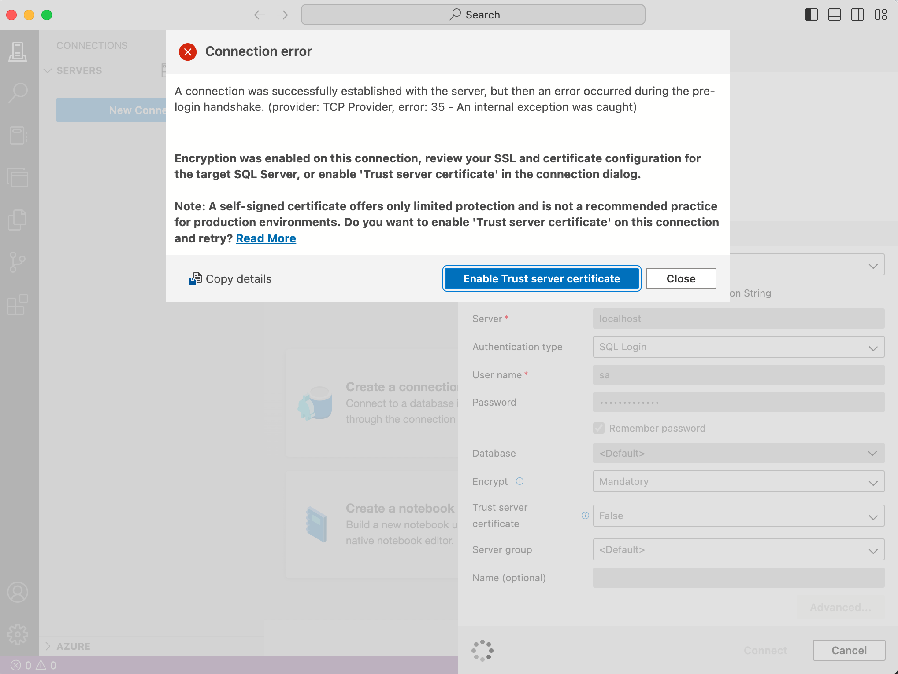

# AspDotNetCore
## Install dotnet
https://www.microsoft.com/net/core#macos

`brew update`
`brew install openssl`
`mkdir -p /usr/local/lib
ln -s /usr/local/opt/openssl/lib/libcrypto.1.0.2l.dylib /usr/local/lib/
ln -s /usr/local/opt/openssl/lib/libssl.1.0.2l.dylib /usr/local/lib/

`run: ulimit -n 512

`sudo dotnet new --install Microsoft.AspNetCore.SpaTemplates::*

npm install -g yo generator-aspnetcore-spa`

## To check version of dotnet
```
$ dotnet --version
8.0.303
```
```
$ dotnet new list

Welcome to .NET 8.0!
---------------------
SDK Version: 8.0.303

Telemetry
---------
The .NET tools collect usage data in order to help us improve your experience. It is collected by Microsoft and shared with the community. You can opt-out of telemetry by setting the DOTNET_CLI_TELEMETRY_OPTOUT environment variable to '1' or 'true' using your favorite shell.

Read more about .NET CLI Tools telemetry: https://aka.ms/dotnet-cli-telemetry

----------------
Installed an ASP.NET Core HTTPS development certificate.
To trust the certificate, run 'dotnet dev-certs https --trust'
Learn about HTTPS: https://aka.ms/dotnet-https

----------------
Write your first app: https://aka.ms/dotnet-hello-world
Find out what's new: https://aka.ms/dotnet-whats-new
Explore documentation: https://aka.ms/dotnet-docs
Report issues and find source on GitHub: https://github.com/dotnet/core
Use 'dotnet --help' to see available commands or visit: https://aka.ms/dotnet-cli
--------------------------------------------------------------------------------------
An issue was encountered verifying workloads. For more information, run "dotnet workload update".
These templates matched your input: 

Template Name       Short Name                  Language    Tags                      
------------------  --------------------------  ----------  --------------------------
API Controller      apicontroller               [C#]        Web/ASP.NET               
ASP.NET Core Empty  web                         [C#],F#     Web/Empty                 
ASP.NET Core gR...  grpc                        [C#]        Web/gRPC/API/Service      
ASP.NET Core We...  webapi                      [C#],F#     Web/Web API/API/Service   
ASP.NET Core We...  webapiaot                   [C#]        Web/Web API/API/Service   
ASP.NET Core We...  mvc                         [C#],F#     Web/MVC                   
ASP.NET Core We...  webapp,razor                [C#]        Web/MVC/Razor Pages       
Blazor Web App      blazor                      [C#]        Web/Blazor/WebAssembly    
Blazor WebAssem...  blazorwasm                  [C#]        Web/Blazor/WebAssembly/PWA
Class Library       classlib                    [C#],F#,VB  Common/Library            
Console App         console                     [C#],F#,VB  Common/Console            
dotnet gitignor...  gitignore,.gitignore                    Config                    
Dotnet local to...  tool-manifest                           Config                    
EditorConfig file   editorconfig,.editorconfig              Config                    
global.json file    globaljson,global.json                  Config                    
MSBuild Directo...  buildprops                              MSBuild/props             
MSBuild Directo...  buildtargets                            MSBuild/props             
MSTest Playwrig...  mstest-playwright           [C#]        Test/MSTest/Playwright    
MSTest Test Pro...  mstest                      [C#],F#,VB  Test/MSTest               
MVC Controller      mvccontroller               [C#]        Web/ASP.NET               
MVC ViewImports     viewimports                 [C#]        Web/ASP.NET               
MVC ViewStart       viewstart                   [C#]        Web/ASP.NET               
NuGet Config        nugetconfig,nuget.config                Config                    
NUnit 3 Test Item   nunit-test                  [C#],F#,VB  Test/NUnit                
NUnit 3 Test Pr...  nunit                       [C#],F#,VB  Test/NUnit                
NUnit Playwrigh...  nunit-playwright            [C#]        Test/NUnit/Playwright     
Protocol Buffer...  proto                                   Web/gRPC                  
Razor Class Lib...  razorclasslib               [C#]        Web/Razor/Library         
Razor Component     razorcomponent              [C#]        Web/ASP.NET               
Razor Page          page                        [C#]        Web/ASP.NET               
Razor View          view                        [C#]        Web/ASP.NET               
Solution File       sln,solution                            Solution                  
Web Config          webconfig                               Config                    
Worker Service      worker                      [C#],F#     Common/Worker/Web         
xUnit Test Project  xunit                       [C#],F#,VB  Test/xUnit     
```

```
sudo dotnet workload update
```

```
$ dotnet new list
These templates matched your input: 

Template Name                                 Short Name                  Language    Tags                      
--------------------------------------------  --------------------------  ----------  --------------------------
API Controller                                apicontroller               [C#]        Web/ASP.NET               
ASP.NET Core Empty                            web                         [C#],F#     Web/Empty                 
ASP.NET Core gRPC Service                     grpc                        [C#]        Web/gRPC/API/Service      
ASP.NET Core Web API                          webapi                      [C#],F#     Web/Web API/API/Service   
ASP.NET Core Web API (native AOT)             webapiaot                   [C#]        Web/Web API/API/Service   
ASP.NET Core Web App (Model-View-Controller)  mvc                         [C#],F#     Web/MVC                   
ASP.NET Core Web App (Razor Pages)            webapp,razor                [C#]        Web/MVC/Razor Pages       
Blazor Web App                                blazor                      [C#]        Web/Blazor/WebAssembly    
Blazor WebAssembly Standalone App             blazorwasm                  [C#]        Web/Blazor/WebAssembly/PWA
Class Library                                 classlib                    [C#],F#,VB  Common/Library            
Console App                                   console                     [C#],F#,VB  Common/Console            
dotnet gitignore file                         gitignore,.gitignore                    Config                    
Dotnet local tool manifest file               tool-manifest                           Config                    
EditorConfig file                             editorconfig,.editorconfig              Config                    
global.json file                              globaljson,global.json                  Config                    
MSBuild Directory.Build.props file            buildprops                              MSBuild/props             
MSBuild Directory.Build.targets file          buildtargets                            MSBuild/props             
MSTest Playwright Test Project                mstest-playwright           [C#]        Test/MSTest/Playwright    
MSTest Test Project                           mstest                      [C#],F#,VB  Test/MSTest               
MVC Controller                                mvccontroller               [C#]        Web/ASP.NET               
MVC ViewImports                               viewimports                 [C#]        Web/ASP.NET               
MVC ViewStart                                 viewstart                   [C#]        Web/ASP.NET               
NuGet Config                                  nugetconfig,nuget.config                Config                    
NUnit 3 Test Item                             nunit-test                  [C#],F#,VB  Test/NUnit                
NUnit 3 Test Project                          nunit                       [C#],F#,VB  Test/NUnit                
NUnit Playwright Test Project                 nunit-playwright            [C#]        Test/NUnit/Playwright     
Protocol Buffer File                          proto                                   Web/gRPC                  
Razor Class Library                           razorclasslib               [C#]        Web/Razor/Library         
Razor Component                               razorcomponent              [C#]        Web/ASP.NET               
Razor Page                                    page                        [C#]        Web/ASP.NET               
Razor View                                    view                        [C#]        Web/ASP.NET               
Solution File                                 sln,solution                            Solution                  
Web Config                                    webconfig                               Config                    
Worker Service                                worker                      [C#],F#     Common/Worker/Web         
xUnit Test Project                            xunit                       [C#],F#,VB  Test/xUnit           
```

```
$ dotnet new mvc
```
```
dotnet run
```

```
$ dotnet add package Microsoft.EntityFrameworkCore
```
> This install package (dotnet project.csproj)
```xml
 <ItemGroup>
    <PackageReference Include="Microsoft.EntityFrameworkCore" Version="8.0.7" />
  </ItemGroup>
```

```
$ dotnet add package Microsoft.EntityFrameworkCore.SqlServer
```
> This install package
```xml
<ItemGroup>
    <PackageReference Include="Microsoft.EntityFrameworkCore" Version="8.0.7" />
    <PackageReference Include="Microsoft.EntityFrameworkCore.SqlServer" Version="8.0.7" />
  </ItemGroup>
```

```
$ dotnet add package Microsoft.EntityFrameworkCore.Tools
```
> This install package
```xml
<ItemGroup>
    <PackageReference Include="Microsoft.EntityFrameworkCore" Version="8.0.7" />
    <PackageReference Include="Microsoft.EntityFrameworkCore.SqlServer" Version="8.0.7" />
    <PackageReference Include="Microsoft.EntityFrameworkCore.Tools" Version="8.0.7">
      <IncludeAssets>runtime; build; native; contentfiles; analyzers; buildtransitive</IncludeAssets>
      <PrivateAssets>all</PrivateAssets>
    </PackageReference>
</ItemGroup>
```

## Create ApDbContext
```cs
using Microsoft.EntityFrameworkCore;

public class AppDbContext : DbContext
{
    public AppDbContext(DbContextOptions<AppDbContext> options) : base(options)
    {

    }

}
```

## Create Student class
```cs
public class Student
{
    public int Id { get; set; }
    public string? Name { get; set; }
    public string? Email { get; set; }
}
```
## Add studet dbset in ApDbContext
```cs
using Microsoft.EntityFrameworkCore;

public class AppDbContext : DbContext
{
    public AppDbContext(DbContextOptions<AppDbContext> options) : base(options)
    {
    }
    public DbSet<Student>? Students { get; set; }

}
```
## Run sql in mac (https://www.youtube.com/watch?v=glxE7w4D8v8)
```
sudo docker pull mcr.microsoft.com/mssql/server:2019-latest
```
```
docker run -d --name sql_server_mac -e 'ACCEPT_EULA=Y' -e 'SA_PASSWORD=DLove@code22!' -p 1433:1433 mcr.microsoft.com/mssql/server:2019-latest
```
> Install sql cli
```
npm install -g sql-cli
```
> Connect to sql
```
$ mssql sa -p DLove@code22!
Connecting to localhost...done

sql-cli version 0.6.2
Enter ".help" for usage hints.
mssql>
```
> test sql
```
mssql> select @@version
                                                                                                                                                                                                
------------------------------------------------------------------------------------------------------------------------------------------------------------------------------------------------
Microsoft SQL Server 2019 (RTM-CU27) (KB5037331) - 15.0.4375.4 (X64) 
	Jun 10 2024 18:00:07 
	Copyright (C) 2019 Microsoft Corporation
	Developer Edition (64-bit) on Linux (Ubuntu 20.04.6 LTS) <X64>

1 row(s) returned
```
## Install GUI for SQL
> Search for "azure data studio download"
```
https://learn.microsoft.com/en-us/azure-data-studio/download-azure-data-studio?tabs=win-install%2Cwin-user-install%2Credhat-install%2Cwindows-uninstall%2Credhat-uninstall
```
> Dwonload the zip file and unzip
> Connect to sql


## Add connection sting in appsettings.json
```json
{
  "Logging": {
    "LogLevel": {
      "Default": "Information",
      "Microsoft.AspNetCore": "Warning"
    }
  },
  "AllowedHosts": "*",
//   "ConnectionStrings": {
//     "Default": "Data Source=localhost;Initial Catalog=StudentDb; Integrated Security=True; TrustServerCertificate=True"
//   },
  "ConnectionStrings": {
  "Default": "Server=localhost,1433;Database=StudentDb;User Id=sa;Password=DLove@code22!;TrustServerCertificate=True"
}

}
```
## Register our dbContext in program.cs
```cs

builder.Services.AddDbContext<AppDbContext>(
    options => options.UseSqlServer(builder.Configuration.GetConnectionString("Default"))
);
```

## Run migrtion
> Install dotnet entityframework ifn mot insatalled
```
dotnet tool install -g dotnet-ef
```
> Check if it dotnet-ef installsed
```
dotnet ef
```
> Add initial migration (This will add migration folder)
```
dotnet ef migrations add initial
```
> Above migration created (20240725060200_initial.cs)
```cs
using Microsoft.EntityFrameworkCore.Migrations;

#nullable disable

namespace dotnet_project.Migrations
{
    /// <inheritdoc />
    public partial class initial : Migration
    {
        /// <inheritdoc />
        protected override void Up(MigrationBuilder migrationBuilder)
        {
            migrationBuilder.CreateTable(
                name: "Students",
                columns: table => new
                {
                    Id = table.Column<int>(type: "int", nullable: false)
                        .Annotation("SqlServer:Identity", "1, 1"),
                    Name = table.Column<string>(type: "nvarchar(max)", nullable: true),
                    Email = table.Column<string>(type: "nvarchar(max)", nullable: true)
                },
                constraints: table =>
                {
                    table.PrimaryKey("PK_Students", x => x.Id);
                });
        }

        /// <inheritdoc />
        protected override void Down(MigrationBuilder migrationBuilder)
        {
            migrationBuilder.DropTable(
                name: "Students");
        }
    }
}
```
## Update database based on the migration
```
dotnet ef database update
```